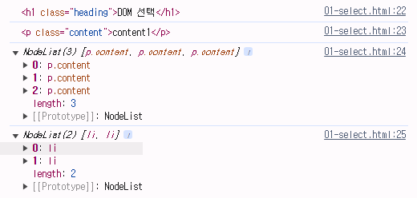

# DOM

날짜: 2024년 10월 21일
태그: JavaScript

# History of JavaScript

- 1차 브라우저 전쟁 영향
    - 웹 표준의 부재로 인해 각 기업에서 자체 표준을 확립하려는 상황 발생
    - ⇒ 이는 웹 개발자들에게 큰 혼란을 주었으며, 결국 웹 표준의 중요성을 인식하는 계기가 됨
- Chrome 브라우저의 등장(2008)
    - Chrome은 출시 3년만에 Firefox 점유율을 넘어서고 그로부터 반년 뒤 IE의 점유율을 넘어섬
- Chrome이 우위를 점하게 된 이유
    - 가장 중요했던 역할은 바로 적극적인 웹 표준 준수
    - 호환성
        - 웹 표준을 준수→ 사용자들은 브라우저 간에 일관된 웹 페이지를 볼 수 있게 됨
        - 다양한 플랫폼 및 기기에서 웹 사이트 일관되게 동작할 수 있음
    - 개발자 도구
        - 웹 개발자를 위한 강력한 도구 제공
- 2차 브라우저 전쟁 영향
    - 다른 브라우저 제조사들도 웹 표준 준수에 대한 중요성을 인식하고 이에 따라 웹 표준을 채택하는 데 더 많은 노력을 기울이게 됨
    - 웹의 기능이 크게 확장되며 웹 애플리케이션의 비약적인 발전을 이끌어 감

## ECMA Script

Ecma International이 정의하고 있는 표준화된 스크립트 프로그래밍 언어 명세

⇒ 스크립트 언어가 준수해야 하는 규칙, 세부사항 등을 제공

### ECMAScript와 JavaScript

- JavaScript는 ECMAScript 표준을 구현한 구체적인 프로그래밍 언어
- ECMAScript의 명세를 기반으로 하여 웹 브라우저나 Node.js와 같은 환경에서 실행됨
- ECMAScript는 JavaScript의 표준이며, JavaScript는 ECMAScript 표준을 따르는 구체적인 프로그래밍 언어
- ECMAScript는 언어의 핵심을 정의하고, JavaScript는 ECMAScript 표준을 따라 구현된 언어로 사용됨

### ECMAScript의 역사

- ECMAScript5 (ES5)에서 안정성과 생산성을 크게 높임
- ECMAScript 2015(ES6)에서 객체지향 프로그래밍 언어로써 많은 발전을 이루어, 역사상 가장 중요한 버전으로 평가됨

### JavaScript의 현재

- 기존에 JavaScript는 브라우저에서만 웹 페이지의 동적인 기능을 구현하는 데에만 사용되었음
- 이후 Node.js로 인해 브라우저 외부에서도 실행 가능해져 서버 사이드 개발에도 사용되기 시작함
- 다양한 프레임워크와 라이브러리들이 개발되면서, 웹 개발 분야에서는 필수적인 언어로 자리 잡게 됨

# 변수

- ES6이후의 명세를 따름
- 권장 스타일 가이드 https://standardjs.com/rules-kokr.html

## 변수 작성 규칙

### 식별자(변수명) 작성 규칙

- 반드시 문자, 달러(`$`) 또는 밑줄(`_`)로 시작
- 대소문자 구분
- 예약어 사용 불가

### 식별자(변수명)Naming case

- camelCase
    - 변수, 객체, 함수에 사용
- PascalCase
    - 클래스, 생성자에 사용
- SNAKE_CASE
    - 상수(constants)에 사용

## 변수 선언

### 변수 선언 키워듸 3가지

1. `let`
2. `const`
3. `~~var~~`

### let

- 블록 스코프(block scope)를 갖는 지역 변수를 선언
- 재할당 가능
- 재선언 불가능
- ES6에서 추가

```jsx
let number = 10 //1. 선언 및 초기값 할당
number = 20 // 2.재할당 가능
```

```jsx
let number = 10 //1. 선언 및 초기값 할당
let number = 20 //2. 재선언 불가능
```

### const

- 블록 스코프를 갖는 지역 변수를 선언
- 재할당 불가능
- 재선언 불가능
- ES6에서 추가

```jsx
const number = 10 //1. 선언 및 초기값 할당
number = 10 //2. 재할당 불가능
```

```jsx
const number = 10 //1. 선언 및 초기값 할당
const number = 20 //2. 재선언 불가능
```

```jsx
const number //(X) 선언 시 반드시 초기값 설정 필요
```

### 블록 스코프(block scope)

- if, for 함수 등의 중괄호 내부를 가리킴
- 블록 스코프를 가지는 변수는 블록 바깥에서 접근 불가능

```jsx
let x = 1

if (x == 1) {
	let x = 2
	console.log(x) //2
}

console.log(x) //1
```

### 어떤 변수 선언 키워드를 사용해야 할까?

- `const`를 기본으로 사용
- 필요한 경우에만 `let`으로 전환
    - 재할당이 필요한 경우
    - let을 사용하는 것은 해당 변수가 의도적으로 변경될 수 있음을 명확히 나타냄
    - 코드의 유연성을 확보하면서도  const의 장점을 최대한 활용할 수 있음

### const를 기본으로 사용해야 하는 경우

- 코드의 의도 명확화
    - 해당 변수가 재할당 되지 않을 것임을 명확히 표현
    - 개발자들에게 변수의 용도와 동작을 더 쉽게 이해할 수 있게 해줌
- 버그 예방
    - 의도치 않은 변수 값 변경으로 인한 버그를 예방
    - 큰 규모의 프로젝트나 팀 작업에서 중요
    - 

# DOM

웹 브라우저에서의 JavaScript → 웹 페이지의 동적인 기능을 구현

### JavaScript 실행 환경 종류

1. HTML `script` 태그
2. `js` 확장자 파일 
3. 브라우저 `Console`

### DOM (Document Object Model)

웹 페이지(Document)를 구조화된 객체로 제공하여 프로그래밍 언어가 페이지 구조에 접근할 수 있는 방법을 제공

→ 문서 구조, 스타일, 내용 등을 변경할 수 있도록 함

### DOM 특징

- DOM에서 모든 요소, 속성, 텍스트는 하나의 객체
- 모두 `document`객체의 하위 객체로 구성됨

### DOM tree

- 브라우저는 HTML 문서를 해석하여 DOM tree라는 객체 트리로 구조화
    
    → 객체 간 상속 구조가 존재
    

> 문서의 요소들을 객체로 제공하여 다른 프로그래밍 언어에서 접근하고 조작할 수 있는 방법을 제공하는 API
> 

## `document` 객체

- 웹 페이지 객체
- DOM tree의 진입점
- 페이지를 구성하는 모든 객체 요소를 포함

# DOM 선택

> 웹 페이지를 동적으로 만들기 == 웹 페에지를 조작하기
> 
- 조작 순서
    1. 조작 하고자 하는 요소를 선택(또는 탐 색)
    2. 선택된 요소의 콘텐츠 또는 속성을 조작

## 선택 메서드

### `document.querySelector(selector)`

- 제공한 선택자와 일치하는 element 한 개 선택

→ 제공한 선택자를 만족하는 첫 번째 element 객체를 반환(없다면 `null`반환)

### `document.querySelectorAll()`

- 제공한 선택자와 일치하는 여러 element를 선택

→ 제공한 선택자를 만족하는 NodeList를 반환

```jsx
<!DOCTYPE html>
<html lang="en">

<head>
  <meta charset="UTF-8">
  <meta name="viewport" content="width=device-width, initial-scale=1.0">
  <title>Document</title>
</head>

<body>
  <h1 class="heading">DOM 선택</h1>
  <a href="https://www.google.com/">google</a>
  <p class="content">content1</p>
  <p class="content">content2</p>
  <p class="content">content3</p>
  <ul>
    <li>list1</li>
    <li>list2</li>
  </ul>

  <script>
    console.log(document.querySelector('.heading')) 
    console.log(document.querySelector('.content')) 
    console.log(document.querySelectorAll('.content'))
    console.log(document.querySelectorAll('ul > li'))
  
  </script>
</body>

</html>

```



# DOM 조작

## 속성 조작

### 1. 클래스 속성 조작

- `classList` property
    
    요소의 클래스 목록을 DOMTokenList(유사 배열) 형태로 반환
    

- `element.classList.add()`
    - 지정한 클래스 값을 추가
- `element.classList.remove()`
    - 지정한 클래스 값을 제거
- `element.classList.toggle()`z
    - 클래스가 존재한다면 제거하고 `false`를 반환
    - 존재하지 않은 클래스를 추가하고 `true`를 반환

- `add()`와 `remove()` 메서드를 사용해 지정한 클래스 값을 추가 혹은 제거

```jsx
    // h1 요소 선택
    const h1Tag = document.querySelector('.heading')
    // h1 요소의 클래스 목록 확인
    console.log(h1Tag.classList)
    // h1 요소의 클래스 목록에 red 클래스 추가
    h1Tag.classList.add('red')
    console.log(h1Tag)

    h1Tag.classList.remove('red')
    console.log(h1Tag.classList)

    h1Tag.classList.toggle('red')
    console.log(h1Tag.classList)
```

### 2. 일반 속성 조작

- `Element.getAttribute()`
    - 해당 요소에 지정된 값을 반환(조회)
- `Element.setAttribute(name, value)`
    - 지정된 요소의 속성 값을 설정
    - 속성이 이미 있으면 기존 값을 갱신(그렇지 않으면 지정된 이름과 값으로 새 속성이 추가)
- `Element.removeAttribute()`
    - 요소에서 지정된 이름을 가진 속성 제거

```jsx
    // a요소 선택
    const aTag = document.querySelector('a')
    console.log(aTag.getAttribute('href'))

    // a요소의 href 속성 값을 naver로 변경
    aTag.setAttribute('href', 'https://www.naver.com/')
    console.log(aTag.getAttribute('href'))

    // a요소의 href 속성 값 삭제
    aTag.removeAttribute('href')
    console.log(aTag.getAttribute('href'))
```

## HTML 콘텐츠 조작

`textContent` property

요소의 텍스트 콘텐츠를 표현 

```jsx
    // HTML 콘텐츠 조작
    const h1Tag = document.querySelector('.heading')
    console.log(h1Tag.textContent)

    h1Tag.textContent = '내용 수정'
    console.log(h1Tag.textContent)
```

## DOM 요소 조작

- `document.createElement(tagName)`
    - 작성한 tagName의 HTML 요소를 생성하여 반환
- `Node.appendChild()`
    - 한 Node를 특정 부모 Node의 자식 NodeList 중 마지막 자식으로 삽입
    - 추가된 Node 객체를 반환
- `Node.removeChild()`
    - DOM에서 자식 Node를 제거
    - 제거된 Node를 반환

```jsx
    // 생성
    const h1Tag = document.createElement('h1')
    h1Tag.textContent = '제목'
    console.log(h1Tag)

    // 추가
    const divTag = document.querySelector('div')
    divTag.appendChild(h1Tag)
    console.log(divTag)
  
    // 삭제
    const pTag = document.querySelector('p')
    divTag.removeChild(pTag)
```

## style 조작

`style` property: 해당 요소의 모든 style 속성 목록을 포함하는 속성

```jsx
    const pTag = document.querySelector('p')

    pTag.style.color = 'crimson'
    pTag.style.fontSize = '2rem'
    pTag.style.border = '1px solid black'
    console.log(pTag.sytle)
```

# 참고

## 용어 정리

### Node

- DOM의 기본 구성 단위
- DOM 트리의 각 부분은 Node라는 객체로 표현됨
    - Document Node: HTML 문서 전체를 나타내는 노드
    - Element Node: HTML 요소를 나타내는 노드
    - Text Node: HTML 텍스트
    - Attribute Node: HTML 요소의 속성을 나타내는 노드

### NodeList

- DOM 메서드를 사용해 선택한 Node의 목록
- 배열과 유사한 구조를 가짐
- Index로만 각 항목에 접근 가능
- Javscript의 배열 메서드 사용 가능
- `querySelectorAll()`에 의해 반환되는 NodeList는 DOM의 변경사항을 실시간으로 반영하지 않음
    - DOM이 나중에 변경되더라도 이전에 이미 선택한 NodeList 값은 변하지 않음

### Element

- Node의 하위 유형
- Element는 DOM 트리에서 HTML 요소를 나타내는 특별한 유형의 Node
- 예를 들어, `<p>`, `<div>`, `<span>`, `<body>`등의 HTML 태그들이 Element 노드를 생성
- Node의 속성과 메서드를 모두 가지고 있으며 추가적으로 요소 특화된 기능(예: `className`, `innerHTML`, `id`등)을 가지고 있음

⇒ 모든 Element는 Node이지만, 모든 Node가 Element인 것은 아님

## Parsing

브라우저가 문자열을 해석하여 DOM Tree로 만드는 과정

## 세미콜론

자바 스크립트는 문장 마지막 세미콜론 (`;`)을 선택적으로 사용 가능

## 변수 선언 키워드 `var`

- ES6 이전에 변수 선언에 사용했던 키워드
- 재할당 가능
- 재선언 가능
- 함수 스코프(function scope)를 가짐
- 호이스팅 되는 특성으로 인해 예기치 못한 문제 발생 가능
    - 선언하기 전 사용할 수 있음
- 변수 선언 시 `var`, `const`, `let` 키워드 중 하나를 사용하지 않으면 자동으로 `var`로 선언됨

### 함수 스코프

- 함수의 중괄호 내부
- 함수 스코프를 가지는 변수는 함수 바깥에서 접근 불가능

### 호이스팅(hoisting)

- 변수 선언이 끌어올려지는 현상
    - `var`로 선언한 변수는 선언 위치와 상관없이 함수 시작 지점, 전역에서는 코드가 시작될 때 처리됨
- 변수에 무언가를 할당하기 전까진 `undefined`를 가짐
-