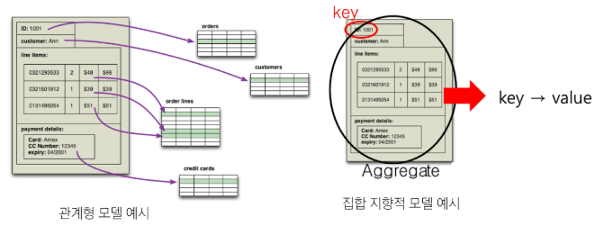

# NoSQL

## Not Only SQL
전통적인 관계형 데이터베이스 관리 시스템(RDBMS)과는 다른 방식으로 데이터를 저장하고 관리하는 비관계형 데이터베이스
- 대규모의 분산된 데이터 저장과 처리를 효율적으로 수행할 수 있도록 설계
- 유연한 스키마(Schema-Less), 수평적 확장성(Scalability), 높은 성능
- 실시간 데이터 관리, 클라우드 보안, 고가용성 애플리케이션에 사용

### 장점
- **유연성**
  - 유연한 스키마를 제공하여 보다 빠르고 반복적인 개발 가능
  - 단점으로는 데이터 중복, 저장 공간 낭비
- **확장성**
  - 고가의 강력한 서버를 추가하는 대신 분산형 하드웨어 클러스터를 이용해 확장하도록 설계
  - 데이터 처리에 대한 일관성은 떨어진다는 단점
- **고성능**
  - 특정 데이터 모델 및 액세스 패턴에 최적화 > 동일 작업 내 RDBMS 대비 고성능
- **고기능성**
  - 데이터 모델에 맞춰 특별히 구축된 뛰어난 기능의 API와 데이터 유형을 제공

### NoSQL 사용사례
- **실시간 데이터 관리**
  - 실시간 추천, 개인화 및 개선된 사용자 경험을 제공
  - 실시간 채팅 앱, 게임 실시간 랭킹 시스템 등에 사용
- **클라우드 보안**
  - 그래프 데이터베이스를 사용하면 RDBMS의 조인 연산보다 효율적으로 복잡한 관계를 신속하게 추적 > 위험성 조기 발견
- **고가용성 애플리케이션**
  - 분산 NoSQL 데이터베이스의 경우 메시징, 소셜 미디어, 파일 공유 등 지연시간이 짧은 고가용성 애플리케이션을 구축하는 데 매우 유용

- **실제 사용 사례**
  - **트위터** : 카산드라(컬럼-패밀리)
  - **페이스북** : 카산드라 + HBase(메시징 서비스)
  - **넷플릭스** : 카산드라 + Simple DB + HBase + Hadoop
  - **구글** : Cloude Firestore(문서 모델)
  - **아마존** : DynamoDB

 

## 어떤 DB를 써야할까?

### 집합 지향(Aggregate Orientation)
데이터를 **집합(aggregate)** 단위로 구성하고 관리하는 데이터 모델링 접근 방식

- 집합의 경계를 어떻게 결정하느냐에 따라 데이터 구성이 달라진다.
- 예: 고객 정보 안에 주문 정보를 포함할 지, 고객과 주문을 분리할 지 선택

### Key-Value Database
데이터를 키(key)와 값(value)의 쌍으로 저장하는 단순한 데이터 모델
- **특징**
  - **높은 성능** : 키를 통해 데이터에 직접 접근하여 검색 속도가 매우 빠름
  - **유연한 데이터 저장** : 값은 구조화되지 않은 데이터일 수 있으며, JSON, XML, 바이너리 데이터 등을 포함
- **사용 사례**
  - 캐싱 시스템, 실시간 애플리케이션, IoT 데이터 저장 등 단순한 데이터 저장 및 조회
- **예시**
  - Redis, Amazon DynamoDB

### Document-Oriented Database
JSON이나 XML과 같은 형식의 문서를 저장하며, 문서 내부의 구조를 기반으로 쿼리와 인덱싱
- **특징**
  - **문서 중심 데이터 모델** : 데이터는 문서(Document) 단위로 저장
  - **유연한 스키마** : 문서의 필드와 데이터 형식이 사전에 정의되지 않음
  - **데이터의 독립성** : 필요한 정보를 한 번에 가져올 수 있어서 효율적
- **사용 사례**
  - 제품 정보, 리뷰, 블로그, 뉴스 아티클 등의 계층적 비정형 콘텐츠에 최적화 되어 있음
- **예시**
  - MongoDB, CouchDB

### Column-Family Database
데이터를 행 컬럼의 집합으로 관리하여, 대규모 데이터 처리와 빠른 읽기/쓰기에 최적화된 구조를 제공
- **특징**
  - **동적 스키마** : 데이터 구조가 유연하며, 각 행의 컬럼 수와 형식이 유연함
  - **수평적 확장성** : 데이터를 여러 노드에 분산하여 저장하고 관리 > 대규모 데이터를 처리하는 데 적합
- **사용 사례**
  - 사용자 행동 로그 및 이벤트 데이터 저장, IoT 데이터, 데이터 분석 및 집계 등 대량의 비정형 데이터

### 공통점
- **스키마리스**
  - 고정된 스키마를 요구하지 않으며, 데이터 구조가 유연
  - 데이터 형태가 자주 변경되거나 다양한 구조를 처리할 때 적합
- **높은 확장성**
  - 데이터를 여러 노드에 분산 저장하여 수평적 확장이 가능
- **빠른 읽기/쓰기 성능**
  - 디스크 I/O와 네트워크 호출을 최소화하여 높은 처리 속도를 제공
- **분산 아키텍쳐**
  - 데이터를 여러 서버에 복제하고 분산 저장하여 내결함성을 보장
  - 장애 시 여러 노드에서 데이터 접근이 가능 > 고가용성을 유지

# FireBase

## 초기 설정
### 1. Firebase 콘솔 접속(기본 설정)
https://firebase.google.com/ 접속 -> "시작하기"

### 2. 프로젝트 생성
- Firebase 프로젝트 시작하기
- 이름 지정하기
- Google 애널리틱스 사용 여부 설정
  - 개발 단계에서는 사용 시에 불필요한 로그만 쌓이고 큰 필요가 없음 -> 비활성화

### 3. 데이터베이스 생성(Firestore)
- 프로젝트 개요 페이지 이동
- 왼쪽 탭 필드 -> "빌드" -> "Firestore Database"
- "데이터베이스 만들기"
- 모드 설정 -> "프로덕션 모드에서 시작"

### 4. 컬렉션 생성
- 데이터베이스 대시보드 -> "컬렉션 시작"
  - 컬렉션: 문서들을 저장하는 폴더
- 새로운 문서 추가

### 5. Vue 설정(Firebase SDK)
- 프로젝트 개요 -> "웹"
  - 웹 앱에 Firebase를 추가하기 위한 준비