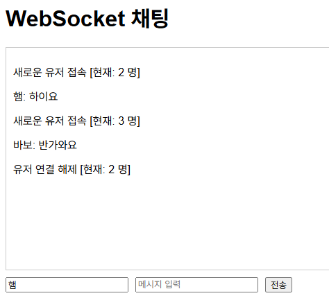

## WebSocket

- 서버와 클라이언트 간에 언제든 양방향 통신이 가능하도록 하는 기술

### 특징

- 실시간, 양방향 및 지속적인 연결
- 짧은 지연 시간의 데이터 교환
- 실시간 채팅이나 게임에 적합

## 과제 목표

- 웹소켓 개발 환경 구축(Node.js와 Express.js 사용)
- 웹소켓을 이용한 메시지 전송 구현(클라이언트에서 서버로)
- 양방향 메시지 전송 구현(브로드캐스트)

## 실습
### 폴더 경로는 무조건 영어로
**문제 상황**
- `node -v`를 하면 버전 정보는 나옴 -> node.js는 설치가 되어있는게 맞음
  - `node index.js`를 아무리 해도 실행이 안 되는 상황

**해결 노력**
- 이것저것 구글링하고 GPT한텐도 물어봤음
  - 환경변수 설정도 다시 해주고
  - bash 썼다가 command prompt 썼다가 하면서 터미널 바꿔주기도 함

**해결 방법**
- 가만히 보니까 폴더 경로 중에 한글로 된 폴더명이 있었음
- 혹시나 해서 영어로 수정한 뒤 `node index.js`해봤는데 문제없이 실행 됐다 ..

> **폴더 경로는 무조건 영어로 설정하자 ㅠㅠ 삽질 그만 !!!**

### 사용자 접속/해제?
- 로컬 서버라 컴퓨터를 하나밖에 못 쓰는데 사용자가 두 명씩 어떻게 접속하나?
- 그냥 `localhost:8000`창을 두 개 열면 두 명이 접속한 거고 세 개 열면 세 명이 접속한 것이었다.