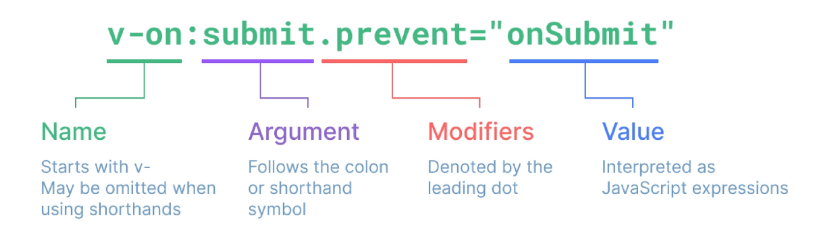

# Basic Syntax 1

날짜: 2024년 11월 4일
태그: Vue


## Directive

`v-` 접두사가 있는 특수 속성

### 특징

- Directive의 속성 값은 단일 JS 표현식이어야 함(`v-for`, `v-on`제외)
- 표현식 값이 변경될 때 DOM에 반응적으로 업데이트를 적용
- 예시
    - `v-if`
        
        ```jsx
        <p v-if="seen">Hi There</p>
        ```
        
        ```jsx
        const app = createApp({
          setup() {
            const seen = ref(false) // seen값이 false면 p태그가 보이지 않음
            ...
        ```
        
    - `v-bind`
        
        ```jsx
        <a v-bind:href="myUrl">Link</a>
        ```
        
        ```jsx
        const myUrl = 'https://www.google.co.kr/'
        ```
        
        개발자 도구에서 봐보면 `v-bind`를 추가하지 않았을 때는 `<a href="myUrl">Link</a>` 였지만, `v-bind`를 추가하면 `<a href="[https://www.google.co.kr/](https://www.google.co.kr/)">Link</a>` 링크가 바인딩됨
        

### Directive 구문



- Arguments
    - 일부 directive는 directve뒤에 콜론(`:`)으로 표시되는 인자를 사용할 수 있다.
    - 아래 예시에서 `href`는 HTML `<a>`요소의 `href`속성 값을 `myUrl`값에 바인딩하도록 하는 `v-bind`의 인자
        
        ```jsx
        <a v-bind:href="myUrl">Link</a>
        ```
        
    - `click`은 이벤트 수신할 이벤트 이름을 작성하는 `v-on`의 인자
        
        ```jsx
        <button v-on:click="doSomething">Button</button>
        ```
        
- Modifiers
    - `.`으로 표시되는 특수 접미사로, directive가 특별한 방식으로 바인딩되어야 함을 나타냄
    - 아래 예시의 `.prevent`는 발생한 이벤트에서 `event.preventDefault()`를 호출하도록 `v-on`에 지시하는 modifier
        
        ```jsx
        <form v-on:submit.prevent="onSubmit">
        	<input type="submit">
        </form>
        ```
        
- Built-in Directives
    
    https://vuejs.org/api/built-in-directives.html
    

# Dynamically data binding

## v-bind

하나 이상의 속성 또는 컴포넌트 데이터를 표현식에 동적으로 바인딩

- v-bind 사용처
    1. Attribute Bindings
    2. Class and Style Bindings

### Attribute Bindings(속성 바인딩)

- HTML의 속성 값을 Vue의 상태 속성 값과 동기화 되도록 함

```jsx
<!-- v-bind.html -->


<a v-bind:href="myUrl">Move to URL</a>
```

- `v-bind` shorthand(약어)
    - `:`
    
    ```jsx
    
    <a :href="myUrl">Move to URL</a>
    ```
    
    `v-bind:`를 `:`로 줄여쓸 수 있다!
    

### Dynamic attribute name(동적 인자 이름)

- 대괄호(`[]`)로 감싸서 directive argument에 JS 표현식을 사용할 수 있음
- 표현식에 따라 동적으로 평가된 값이 최종 argument값으로 사용됨

```jsx
<button :[key]="myValue"></button>
```

- 대괄호 안에 작성하는 이름은 반드시 소문자로만 구성 가능(브라우저가 속성 이름을 소문자로 강제 변환하기 때문)

```jsx
    <p :[dynamicattr]="dynamicValue">Dynamic Attr</p>
```

## Class and Style Bindings

- `class`와 `style`은 모두 HTML 속성이므로 다른 속성과 마찬가지로 `v-bind`를 사용하여 동적으로 문자열 값을 할당할 수 있음
- Vue는 `class` 및 `style`속성 값을 `v-bind`로 사용할 때 객체 또는 배열을 활용하여 작성할 수 있도록 함
    - 단순히 문자열 연결을 사용하여 이러한 값을 생성하는 것은 번거롭고 오류가 발생하기 쉽기 때문
- Class and Style Bindings가 가능한 경우
    1. Binding `HTML` Classes
        1. binding to `Objects`
        2. binding to `Arrays`
    2. Binding Inline `Styles`
        1. Binding to `Objects`
        2. Binding to `Arrays`

### Binding to HTML Classes

- Binding to `Objects`
    - 객체를 `:class`에 전달하여 클래스를 동적으로 전환할 수 있음
    - 예시 1
        - `isActive`의 Boolean 값에 의해 `active` 클래스의 존재가 결정됨
            
            ```jsx
            const isActive = ref(true)
            ```
            
            ```jsx
            <div :class="{ active: isActive }">Text</div>
            ```
            
    - 객체에 더 많은 필드를 포함하여 여러 클래스를 전환할 수 있음
    - 예시 2
        - `:class` directive를 일반 클래스 속성과 함께 사용 가능
            
            ```jsx
            const isActive = ref(true)
            const hasInfo = ref(true)
            ```
            
            ```jsx
            <div class="static" :class="{ active: isActive, 'text-primary': hasInfo }">Text</div>
            ```
            
    - 반응형 변수를 활용해 객체를 한번에 작성할 수 있다.
    - 예시 3
        - 반드시 inline방식으로 작성하지 않아도 됨
            
            ```jsx
              const isActive = ref(true)
              const hasInfo = ref(true)
              const classObj = ref({
                active: isActive,
                'text-primary': hasInfo
              })
            ```
            
            ```jsx
                <div class="static" :class="classObj">Text</div>
            ```
            
- Binding to `Arrays`
    - `:class`를 배열에 바인딩하여 클래스 목록을 적용할 수 있음
    - 예시 1
        
        ```
        const activeClass = ref('active')
        const infoClass = ref('text-primary')
        ```
        
        ```
        <div :class="[activeClass, infoClass]">Text</div>
        ```
        
    - 예시 2
        - 배열 구문 내에서 객체 구문을 사용
        
        ```
        <div :class="[{ active: isActive }]">Text</div>
        ```
        

### Binding Inline Styles

- Binding to `Objects`
    - `:style`은 JS 객체 값에 대한 바인딩을 지원(HTML `style` 속성에 해당)
    - 예시 1
        
        ```jsx
        const activeColor = ref('crimson')
        const fontSize = ref(50)
        ```
        
        ```jsx
        <div :style="{ color: activeColor, fontSize: fontSize+'px' }">Text</div>
        ```
        
    - 실제 css에서 사용하는 것처럼 `:style`은 `kebab-case`키 문자열도 지원(단, `camelCase`작성을 권장)
    - 예시 2
        
        ```jsx
        <div :style="{ color: activeColor, 'font-size': fontSize+'px' }">Text</div>
        ```
        
    - 반응형 변수를 활용해 객체를 한번에 작성
        - 반드시 inline 방식으로 작성하지 않아도 된다.
    - 예시 3
        
        ```jsx
          const activeColor = ref('crimson')
          const fontSize = ref(50)
        
          const styleObj = ref({
            color : activeColor,
            fontSize : fontSize.value + 'px'
          })
        ```
        
        ```jsx
          <div :style="styleObj">Text</div>
        ```
        
- Binding to `Arrays`
    - 여러 스타일 객체를 배열에 작성해서 `:style`을 바인딩할 수 있음
    - 작성한 객체는 병합되어 동일한 요소에 적용된다.
    - 예시
        
        ```jsx
        const activeColor = ref('crimson')
        const fontSize = ref(50)
        
        const styleObj = ref({
          color : activeColor,
          fontSize : fontSize**.value** + 'px'
        })
        
        const styleObj2 = ref({
          color: 'blue',
          border: '1px solid black'
        })
        ```
        
        ```jsx
        <div :style="[styleObj, styleObj2]">Text</div>
        ```
        

# Event Handling

## v-on

DOM 요소에 이벤트 리스너를 연결 및 수신

```jsx
v-on:event="handler"
```

- handler 종류
    1. Inline handlers: 이벤트가 트리거될 때 실행 될 JS 코드
    2. Method handlers: 컴포넌트에 정의된 메서드 이름
- `v-on` shorthand(약어)
    - `@`
    
    ```jsx
    @event="handler"
    ```
    

### Inline handlers

- Inline handlers는 주로 간단한 상황에 사용
    
    ```jsx
    const count = ref(0)
    ```
    
    ```jsx
    <button @click="count++">Add 1</button>
    <p>Count: {{ count }}</p>
    ```
    
    - 권장되는 문법은 아님
- Inline Handlers에서의 메서드 호출
    - 메서드 이름에 직접 바인딩하는 대신 Inline handlers에서 메서드를 호출할 수도 있음
    - 이렇게 하면 기본 이벤트 대신 사용자 지정 인자를 전달할 수 있음
    - 예시 1
        
        ```
          const increase = function () {
            count.value++
          }
        ```
        
        ```jsx
        <button @click="increase">Add 1</button>
        <p>Count: {{ count }}</p>
        ```
        
    - 예시 2
        
        ```jsx
          const greeting = function (message) {
            console.log(message)
          }
        ```
        
        ```jsx
          <button @click="greeting('hello')">Say hello</button>
          <button @click="greeting('bye')">Say bye</button>
        ```
        
- Inline Handlers에서의 event 인자에 접근하기
    - Inline handlers에서 원래 DOM 이벤트에 접근하기
    - `$event`변수를 사용하여 메서드에 전달
    
    ```jsx
      const warning = function (message, event) {
        console.log(message)
        console.log(event)
      }
    ```
    
    ```jsx
      <button @click="warning('경고입니다', $event)">Submit</button>
    ```
    

### Method Handlers

- Inline handlers로는 불가능한 대부분의 상황에 사용
    
    ```jsx
      const name = ref('Alice')
      const myFunc = function (event) {
        console.log(event)
        console.log(event.currentTarget)
        console.log(name.value)
      }
    ```
    
    ```jsx
    <button @click="myFunc">Hello</button>
    ```
    
- Method handlers는 이를 트리거 하는 기본 DOM `Event` 객체를 자동으로 수신한다.

## Modifiers

### Event Modifiers

- Event Modifiers를 활용해 `event.preventDefault()`와 같은 구문을 메서드에서 작성하지 않도록 함
- `stop`, `prevent`, `self`등 다양한 modifiers를 제공
- 메서드는 DOM 이벤트에 대한 처리보다는 데이터에 관한 논리를 작성하는 것에 집중할 것
    
    ```jsx
    <form v-on:submit.prevent="onSubmit">
      <input type="submit">
    </form>
    ```
    
    ```jsx
    <a v-on:click.stop.prevent="onLink">onLink</a>
    ```
    
- Modifiers는 chained 되게끔 작성할 수 있으며 이때는 작성된 순서로 실행되기 때문에 작성 순서에 유의!

### Key Modifiers

- 키보드 이벤트를 수신할 때 특정 키에 관한 별도 modifiers를 사용할 수 있음
- 예시
    - key가 Enter일 때만 `onSubmit` 이벤트를 호출하기
    
    ```jsx
    <input v-on:keyup.enter="onSubmit">
    ```
    

# Form Input Bindings

- `form`을 처리할 때 사용자가 `input`에 입력하는 값을 실시간으로 JS 상태에 동기화해야 하는 경우(양방향 바인딩)
- 양방향 바인딩 방법
    1. `v-bind`와 `v-on`을 함께 사용
    2. `v-model` 사용

## v-bind와 v-on을 함께 사용

1. `v-bind`를 사용하여 `input` 요소의 `value` 속성 값을 입력 값으로 사용
2. `v-on`을 사용하여 `input` 이벤트가 발생할 때 마다 `input` 요소의 `value` 값을 별도 반응형 변수에 저장하는 핸들러를 호출

```jsx
  const inputText1 = ref('')
  const onInput = function (event) {
    inputText1.value = event.currentTarget.value
  }
```

```jsx
<p>{{ inputText1 }}</p>
<input :value="inputText1" @input="onInput">
```

## v-model

`form input` 요소 또는 컴포넌트에서 양방향 바인딩을 만듦

- 사용자 입력 데이터와 반응형 변수를 실시간 동기화

```jsx
const inputText2 = ref('')
```

```jsx
<p>{{ inputText2 }}</p>
<input v-model="inputText2">
```

- 영어 기준으로 작동하기 때문에, IME가 필요한 언어(한국어, 중국어, 일본어 등)의 경우 `v-model`이 제대로 업데이트 되지 않음
- 해당 언어에 대해 올바르게 응답하려면 `v-bind`와 `v-on` 방법을 사용해야 한다.

### v-model 활용

`v-model`은 단순 `Text input`뿐만 아니라 `Checkbox`, `Radio`, `Select` 등 다양한 타입의 사용자 입력 방식과 함께 사용 가능

- Checkbox
    - 단일 체크박스와 `boolean`값 활용
        
        ```jsx
        const checked = ref(false)
        ```
        
        ```jsx
        <!-- single checkbox -->
        <input type="checkbox" id="checkbox" v-model="checked">
        <label for="checkbox">{{ checked }}</label>
        ```
        
    - 여러 체크박스와 배열 활용
        - 해당 배열에는 현재 선택된 체크박스의 값이 포함됨
        
        ```jsx
        const checkedNames = ref([])
        ```
        
        ```jsx
        <!-- multiple checkbox -->
        <div>Checked names: {{ checkedNames }}</div>
        
        <input type="checkbox" id="alice" value="Alice" v-model="checkedNames">
        <label for="alice">Alice</label>
        
        <input type="checkbox" id="bella" value="Bella" v-model="checkedNames">
        <label for="bella">Bella</label>
        ```
        
- Select
    - `select`에서 `v-model` 표현식의 초기 값이 어떤 `option`과도 일치하지 않는 경우 `select` 요소는 선택되지 않은(unselected) 상태로 렌더링 됨
    
    ```jsx
    const selected = ref([])
    ```
    
    ```
    <!-- single select -->
    <div>Selected: {{ selected }}</div>
    
    <select v-model="selected">
      <option disabled value="">Please select one</option>
      <option>Alice</option>
      <option>Bella</option>
      <option>Cathy</option>
    </select>
    ```
    

# 참고

## 접두어 $

- Vue 인스턴스 내에서 제공되는 내부 변수
    - 사용자가 지정한 반응형 변수나 메서드와 구분하기 위해서 사용
    - 주로 Vue 인스턴스 내부 상태를 다룰 때 사용

## IME(Input Method Editor)

- 사용자가 입력 장치에서 기본적으로 사용할 수 없는 문자(비영어권 언어)를 입력할 수 있도록 하는 운영 체제 구성 프로그램
- 일반적으로 키보드 키보다 자모가 더 많은 언어에서 사용해야 함

⇒ IME가 동작하는 방식과 Vue의 양방향 바인딩(`v-model`)동작 방식이 상충하기 때문에 한국어 입력 시 예상대로 동작하지 않았던 것