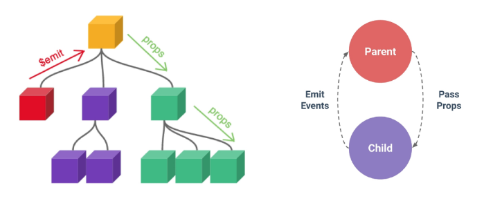

# Component State Flow

날짜: 2024년 11월 7일
태그: Vue.js


# Passing Props

## Props

- 동일한 사진 데이터를 한 화면에 다양한 위치에서 여러 번 출력해야 할 때
    - 컴포넌트가 개별적으로 동일한 데이터를 관리 (X)
    - 공통된 부모 컴포넌트에서 관리 (O)



부모는 자식에게 데이터를 전달(`Pass Props`)하며, 자식은 자신에게 일어난 일을 부모에게 알림(`Emit event`)

### Props

부모 컴포넌트로부터 자식 컴포넌트로 데이터를 전달하는데 사용되는 속성

- 부모 속성이 업데이트되면 자식으로 전달 되지만 그 반대는 안 됨
- 즉, 자식 컴포넌트 내부에서 `props`를 변경하려고 시도해서는 안되며 불가능하다.
- 또한 부모 컴포넌트가 업데이트될 때마다 이를 사용하는 자식 컴포넌트의 모든 `props`가 최신 값으로 업데이트 됨

⇒ 부모 컴포넌트에서만 변경하고 이를 내려 받는 자식 컴포넌트는 자연스럽게 갱신된다.

### One-Way Data Flow

모든 `props`는 자식 속성과 부모 속성 사이에 하향식 단방향 바인딩을 형성(one-way-down binding)

- 단방향인 이유 ?
    - 하위 컴포넌트가 실수로 상위 컴포넌트의 상태를 변경하여 앱에서의 데이터 흐름을 이해하기 어렵게 만드는 것을 방지하기 위함
    
    ⇒ 데이터 흐름의 **일관성** 및 **단순화**
    

## Props 선언

부모 컴포넌트에서 내려 보낸 `props`를 사용하기 위해서는 자식 컴포넌트에서 명시적인 `props`선언이 필요하다.

### 사전 준비

1. Vue 프로젝트 생성
2. 초기 생성된 컴포넌트 모두 삭제(`App.vue` 제외)
3. `src/assets/` 내부 파일 모두 삭제
4. `main.js` 내부의 `import './assets/main.css'` 코드 삭제
5. `App` > `Parent` > `ParentChild`  컴포넌트 관계 작성
    1. `App` 컴포넌트 작성
        
        ```jsx
        <!-- App.vue -->
        
        <template>
          <div>
            <Parent />
          </div>
        </template>
        
        <script setup>
        import Parent from '@/components/Parent.vue'
        </script>
        ```
        
    2. `Parent` 컴포넌트 작성
        
        ```jsx
        <!-- Parent.vue -->
        
        <template>
          <div>
            <ParentChild />
          </div>
        </template>
        
        <script setup>
        import ParentChild from '@/components/ParentChild.vue'
        </script>
        ```
        
    3. `ParentChild` 컴포넌트 작성
        
        ```jsx
        <!-- ParentChild.vue -->
        
        <template>
        	<div></div>
        </template>
        
        <script setup>
        </script>
        ```
        

### Props 작성

- 부모 컴포넌트 `Parent`에서 자식 컴포넌트 `ParentChild`에 보낼 `props` 작성
    - `{props 이름}="{props 값}"`

```jsx
<template>
  <div>
    <ParentChild my-msg="message" />
  </div>
</template>
```

### Props 선언

```jsx
<script setup>
defineProps()
</script>
```

- `defineProps()`를 사용하여 `props`를 선언
- `defineProps()`에 작성하는 인자의 데이터 타입에 따라 선언 방식이 나뉨
    - “문자열 배열”을 사용한 선언
    - “객체”를 사용한 선언

### 문자열 배열을 사용한 선언

- 배열의 문자열 요소로 `props` 선언
- 문자열 요소의 이름은 전달된 `props`의 이름

```jsx
<!-- ParentChild.vue -->

<script setup>
defineProps(['myMsg'])
</script>
```

### 객체를 사용한 선언

- 각 객체 속성의 키가 전달받은 `props` 이름이 되며, 객체 속성의 값은 값이 될 데이터의 타입에 해당하는 생성자 함수 (`Number`, `String` … )여야 함

```jsx
<!-- ParentChild.vue -->

<script setup>
defineProps({  
	myMsg: String
})
</script>
```

### props 데이터 사용

- `props` 선언 후 템플릿에서 반응형 변수와 같은 방식으로 활용할 수 있다.

```jsx
<!-- ParentChild.vue -->

<div>
	<p>{{ myMsg }}</p>
</div>
```

- `props`를 객체로 반환하므로 필요한 경우 JavaScript에서 접근 가능하다.

```jsx
<script setup>
const props = defineProps({ myMsg: String })
console.log(props) // {myMsg: 'message'}
console.log(props.myMsg) // 'message'
</script>
```

### 한 단계 더 props 내려보내기

- `ParentChild` 컴포넌트를 부모로 갖는 `ParentGrandChild` 컴포넌트 생성 및 등록

```jsx
<!-- ParentGrandChild.vue -->

<template>
	<div></div>
</template>

<script setup>
</script>
```

```jsx
<!-- ParentChild.vue -->

<template>
	<div>
		<p>{{ myMsg }}</p>
		<ParentGrandChild />
	</div>
</template>

<script setup>
import ParentGrandChild from '@/components/ParentGrandChild.vue'

defineProps({
	myMsg: String,
})
</script>
```

- `ParentChild` 컴포넌트에서 Parent로부터 받은 `props`인 `myMsg`를 `ParentGrandChild`에게 전달

```jsx
<!-- ParentChild.vue -->

<template>
	<div>
		<p>{{ myMsg }}</p>
		<ParentGrandChild :my-msg="myMsg" /> //v-bind를 사용한 동적 props
	</div>
</template>
```

```jsx
<!-- ParentGrandChild.vue -->

<template>
	<div>
		<p>{{ myMsg }}</p>
	</div>
</template>

<script setup>
defineProps({
	myMsg: String,
})
</script>
```

- `ParentGrandChild`가 받아서 출력하는 `props`는 `Parent`에 정의되어 있는 `props`이며, `Parent`가 `props`를 변경할 경우 이를 전달받고 있는 `ParentChild`, `ParentGrandChild`에서도 모두 업데이트 됨

## Props 세부사항

### Props Name Casing

- 자식 컴포넌트로 전달 시에는 kebab-case

```jsx
<ParentChild my-msg="message" />
```

- 선언 및 템플릿 참조 시에는 camelCase

```jsx
defineProps({
	myMsg: String
})
```

```jsx
<p>{{ myMsg }}</p>
```

### Static props & Dynamic props

- `v-bind`를 사용하여 동적으로 할당된 `props`를 사용할 수 있음

```jsx
<!-- Parent.vue -->

import { ref } from 'vue'

const name = ref('Alice')
```

```jsx
<!-- Parent.vue -->

<ParentChild my-msg="message" :dynamic-props="name" />
```

- Dynamic props 선언 및 출력

```jsx
<!-- ParentChild.vue -->

defineProps({
	myMsg: String,
	dynamicProps: String,
})
```

```jsx
<!-- ParentChild.vue -->

<p>{{ dynmaicProps }}</p>
```

## Props 활용

### 다른 디렉티브와 함께 사용

- `v-for`와 함께 사용하여 반복되는 요소를 `props`로 전달하기
- `ParentItem` 컴포넌트 생성 및 `Parent`의 하위 컴포넌트로 등록

```jsx
<!-- ParentItem.vue -->

<template>
	<div>
	</div>
</template>

<script setup>
</script>
```

```jsx
<!-- Parent.vue -->

<template>
	<div>
		<ParentItem />
	</div>
</template>

<script setup>
import ParentItem from '@/components/ParentItem.vue'
</script>
```

- 데이터 정의 및 `v-for` 디렉티브의 반복 요소로 활용
- 각 반복 요소를 `props`로 내려보내기

```jsx
<!-- Parent.vue -->

const items = ref([
	{ id: 1, name: '사과' },
	{ id: 2, name: '바나나' },
	{ id: 3, name: '딸기' }
])
```

```jsx
<!-- Parent.vue -->

<ParentItem
	v-for="item in items"
	:key="item.id"
	:my-prop="item"
/>
```

- `props` 선언

```jsx
<!-- ParentItem.vue -->

<template>
	<div>
		<p>{{ myProp.id }}</p>
		<p>{{ myProp.name }}</p>
	</div>
</template>

<script setup>
defineProps({
	myProp: Object
})
</script>
```

# Component Events

## Emit

부모가 `props` 데이터를 변경하도록 소리쳐야 함 📢

### `$emit()`

자식 컴포넌트가 이벤트를 발생시켜 부모 컴포넌트로 데이터를 전달하는 역할의 메서드

 *`$` 표기는 Vue 인스턴스의 내부 변수들을 가리킴

### emit 메서드 구조

`$emit(event, ...args)`

- `event`
    - 커스텀 이벤트의 이름
- `args`
    - 추가 인자

## 이벤트 발신 및 수신

- `$emit`을 사용하여 템플릿 표현식에서 직접 사용자 정의 이벤트를 발신

```jsx
<button @click="$emit('someEvent')">클릭</button>
```

- 그런 다음 부모는 `v-on`을 사용하여 수신할 수 있음

```jsx
<ParentComp @some-event="someCallback" />
```

### 이벤트 발신 및 수신하기

- `ParentChild`에서 `someEvent`라는 이름의 사용자 정의 이벤트를 발신

```jsx
<!-- ParentChild.vue -->

<button @click="$emit('someEvent')">클릭</button>
```

- `ParentChild`의 부모 `Parent`는 `v-on`을 사용하여 발신된 이벤트를 수신
- 수신 후 처리할 로직 및 콜백함수 호출

```jsx
<!-- Parent.vue -->

<ParentChild @some-event="someCallback" my-msg="message" :dynamic-props="name" />
```

```jsx
<!-- Parent.vue -->

const someCallback = function () {
	console.log('ParentChild가 발신한 이벤트를 수신했어요.) 
}
```

## emit 이벤트 선언

위에 버전은 vue2버전이므로 이 방식으로 emit이벤트 선언하기

- `defineEmits()`를 사용하여 발신할 이벤트를 선언
- `props`와 마찬가지로 `defineEmits()`에 작성하는 인자의 데이터 타입에 따라 선언 방식이 나뉨(배열, 객체)
- `defineEmits()`는 `$emit`대신 사용할 수 있는 동등한 함수를 반환(script에서는 `$emit`메서드를 접근할 수 없기 때문)

```jsx
<script setup>
defineEmits()
</script>
```

```jsx
<script setup>
const emit = defineEmits(['someEvent', 'myFocus'])

const buttonClick = function () {
	emit('someEvent')
}
</script> 
```

### 이벤트 선언 활용

- 이벤트 선언 방식으로 추가 버튼 작성 및 결과 확인

```jsx
<!-- ParentChild.vue -->

<script setup>
const emit = defineEmits(['someEvent'])

const buttonClick = function () {
	emit('someEvent')
}
</script> 
```

```jsx
<!-- ParentChild.vue -->

<button @click="buttonClick">클릭</button>
```

## 이벤트 전달

### 이벤트 인자(Event Arguments)

- 이벤트 발신 시 추가 인자를 전달하여 값을 제공할 수 있음
- `ParentChild`에서 이벤트를 발신하여 `Parent`로 추가 인자 전달하기

```jsx
<!-- ParentChild.vue -->

const emit = defineEmits(['someEvent', 'emitArgs'])

const emitArgs= function () {
	emit('emitArgs', 1, 2, 3)
}
```

```jsx
<!-- ParentChild.vue -->

<button @click="emitArgs">추가 인자 전달</button>
```

- `ParentChild`에서 발신한 이벤트를 `Parent`에서 수신

```jsx
<!-- Parent.vue -->

<ParentChild
	@some-event="someCallback"
	@emit-args="getNumbers"
	my-msg="message"
	:dynamic-props="name"
/>
```

```jsx
<!-- Parent.vue -->

const getNumbers = function (...args) {
	console.log(args)
	console.log(`ParentChild가 전달한 추가인자 ${args}를 수신했어요.`)
}
```

## 이벤트 세부사항

### Event Name Casing

- 선언 및 발신시에는 camelCase

```jsx
<button @click="$emit('someEvent')">클릭</button>
```

```jsx
const emit = defineEmits(['someEvent'])

emit('someEvent')
```

- 부모 컴포넌트에서 수신 시에는 kebab-case

```jsx
<ParentChild @some-event="..." />
```

## emit 이벤트 활용

- 최하단 컴포넌트 `ParentGrandChild`에서 `Parent` 컴포넌트의 `name` 변수 변경 요청하기

### 구현

- `ParentGrandChild`에서 이름 변경을 요청하는 이벤트를 발신

```jsx
<!-- ParentGrandChild.vue -->

const emit = defineEmits(['updateName'])

const updateName = function () {
	emit('updateName')
}
```

```jsx
<!-- ParentGrandChild.vue -->

<button @click="updateName">이름 변경</button>
```

- 이벤트 수신 후 이름 변경을 요청하는 이벤트 발신 (ParentChild에서 Parent로)

```jsx
<!-- ParentChild.vue -->

const emit = defineEmits(['someEvent', 'emitArgs', 'updateName'])

const updateName = function () {
	emit('updateName')
}
```

```jsx
<!-- ParentChild.vue -->

<ParentGrandChild :my-msg="myMsg" @update-name="updateName" />
```

- 이벤트 수신 후 이름 변수 변경 메서드를 호출한다.
- 해당 변수를 `props`으로 받는 모든 곳에서 자동 업데이트 한다.

```jsx
<!-- Parent.vue -->

<ParentChild @update-name="updateName" />
```

```jsx
<!-- Parent.vue -->

const updateName = function () {
	name.value = 'Bella'
}
```

# 참고

## 정적& 동적 props 주의사항

```jsx
<SomeComponent num-props="1" /> // 정적 props로 문자열 "1"을 전달한 것
```

```jsx
<SomeComponent :num-props="1" /> // 동적 props로 숫자 1을 전달한 것
```

## Props & Emit 객체 선언 문법

- `props` 선언 시에는 객체 선언 문법을 권장함.
- 컴포넌트를 가독성이 좋게 문서화하는 데 도움이 되며, 다른 개발자가 잘못된 유형을 전달할 때에 브라우저 콘솔에 경고를 출력하도록 하기 때문이다.
- 추가로 `props`에 대한 유효성 검사로써 활용 가능하다.

- emit 이벤트도 객체 선언 문법으로 작성 가능하다.
- 객체 구문으로 선언된 경우, 유효성을 검사할 수 있음.