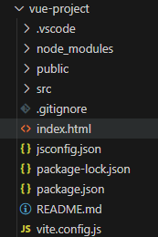

# Single-File Components

날짜: 2024년 11월 6일
태그: Vue.js


# Single File Components

## Component

재사용 가능한 코드 블록

### 특징

- UI를 독립적이고 재사용 가능한 일부분으로 분할하고 각 부분을 개별적으로 다룰 수 잇음

⇒ 자연스럽게 애플리케이션은 중첩된 Component의 트리 형태로 구성됨

- 웹 서비스는 여러 개의 `Component`로 이루어져 있음

### Single File Components(SFC)

컴포넌트의 템플릿, 로직 및 스타일을 하나의 파일로 묶어낸 특수한 파일 형식(`*.vue` 파일)

- Vue SFC는 HTML, CSS 및 JavaScript를 단일 파일로 합친 것
- `<template>`, `<script>` 및 `<style>` 블록은 하나의 파일에서 컴포넌트의 뷰, 로직 및 스타일을 독립적으로 배치

## SFC 구성요소

- 각 `*.vue`파일은 세 가지 유형의 최상위 언어 블록 `<template>`, `<script>`, `<style>`으로 구성됨

⇒ 언어 블록의 작성 순서는 상관 없으나 일반적으로 `template` → `script` → `style`순서로 작성한다.

### `<template>` 블록

```jsx
<template>
    <div class="greeting">
        {{ msg }}
    </div>
</template>
```

- 각 `*.vue`파일은 최상위 `<template>`블록을 하나만 포함할 수 있음

### `<script setup>` 블록

```jsx
<script setup>

import { ref } from 'vue'
const msg = ref('hello')

</script>
```

- 각 `*.vue`파일은 `<script setup>` 블록을 하나만 포함할 수 있음(일반 `<script>` 제외)
- 컴포넌트의 `setup()` 함수로 사용되며 컴포넌트의 각 인스턴스에 대해 실행

⇒ 변수 및 함수는 동일한 컴포넌트의 템플릿에서 자동으로 사용 가능

### `<style scoped>` 블록

```jsx
<style scoped>
.greeting {
    color: red;
}

</style>
```

- `*.vue`파일에는 여러 `<style>`태그가 포함될 수 있음
- `scoped`가 지정되면 CSS는 현재 컴포넌트에만 적용됨

# SFC build tool

## Vite

프론트 엔드 개발도구 

빠른 개발 환경을 위한 빌드 도구와 개발 서버를 제공

https://vite.dev/

비트[veet]라고 읽는다.

### Build

- 프로젝트의 소스 코드를 최적화하고 번들링하여 배포할 수 있는 형식으로 변환하는 과정
- 개발 중에 사용되는 여러 소스 파일 및 리소스(JavaScript, CSS, 이미지 등)를 최적화된 형태로 조합하여 최종 소프트웨어 제품을 생성하는 것

⇒ Vite는 이러한 빌드 프로세스를 수행하는 데 사용되는 도구

## Vue Project

### Vue Project 생성

- Vue Project (Application) 생성 (Vite 기반 빌드)

```bash
$ npm create vue@latest
```

- 프로젝트 설정 관련 절차 진행

```bash
Need to install the following packages:
create-vue@3.12.0
Ok to proceed? (y)

> npx
> create-vue

Vue.js - The Progressive JavaScript Framework

√ Project name: ... vue-project
√ Add TypeScript? ... No / Yes
√ Add JSX Support? ... No / Yes
√ Add Vue Router for Single Page Application development? ... No / Yes
√ Add Pinia for state management? ... No / Yes
√ Add Vitest for Unit Testing? ... No / Yes
√ Add an End-to-End Testing Solution? » No
√ Add ESLint for code quality? » No
√ Add Vue DevTools 7 extension for debugging? (experimental) ... No / Yes

Scaffolding project in C:\Users\SSAFY\Codes\lecture\vue\03-single-file-components\vue-project...  

Done. Now run:

  cd vue-project
  npm install
  npm run dev
```

- 프로젝트 폴더 이동

```bash
$ cd vue-project
```

- 패키지 설치

```bash
$ npm install
```

- Vue 프로젝트 서버 실행

```bash
$ npm run dev
```

## NPM

### Node Package Manager(NPM)

Node.js의 기본 패키지 관리자

### Node.js

Chrome의 V8 JavaScript 엔진을 기반으로 하는 Server-side 실행 환경

### Node.js의 영향

- 기존에 브라우저 안에서만 동작할 수 있었던 JS를 브라우저가 아닌 서버 측에서도 실행할 수 있게 함
    - 프론트엔드와 백엔드에서 동일한 언어로 개발할 수 있게 됨
- NPM을 활용해 수많은 오픈 소스 패키지와 라이브러리를 제공하여 개발자들이 손쉽게 코드를 공유하고 재사용할 수 있게 함

## 모듈과 번들러

### 모듈(Module)

프로그램을 구성하는 독립적인 코드 블록(`*.js`파일)

### 모듈의 필요성

- 개발하는 애플리케이션의 크기가 커지고 복잡해지면서 파일 하나에 모든 기능을 담기가 어려워짐
- 따라서 자연스럽게 파일을 여러 개로 분리하여 관리를 하게 되었고, 이 때 분리된 각 파일이 바로 모듈(module)

⇒ `*.js`파일 하나가 하나의 모듈

### 모듈의 한계

- 하지만 애플릴케이션이 점점 더 발전함에 따라 처리해야 하는 JS 모듈의 개수도 극적으로 증가
- 이러한 상황에서 성능 병목 현상이 발생하고, 모듈 간의 의존성(연결성)이 깊어지면서 특정한 곳에서 발생한 문제가 어떤 모듈 간의 문제인지 파악하기 어려워 짐
- 복잡하고 깊은 모듈 간 의존성 문제를 해결하기 위한 도구가 필요
    
    ⇒ `Bundler` 
    

### 번들러(Bundler)

여러 모듈과 파일을 하나(혹은 여러 개)의 번들로 묶어 최적화하여 애플리케이션에서 사용할 수 있게 만들어주는 도구

### 번들러의 역할

- 의존성 관리, 코드 최적화, 리소스 관리 등
- 번들러가 하는 작업을 번들링(Bundling)이라 함

[참고] Vite는 Rollup이라는 Bundler를 사용하며 개발자가 별도로 기타 환경설정에 신경쓰지 않도록 모두 설정해두고 있음

# Vue Project 구조



### `node_modules`

- Node.js 프로젝트에서 사용되는 외부 패키지들이 저장되는 디렉토리
- 프로젝트의 의존성 모듈을 저장하고 관리하는 공간
- 프로젝트가 실행될 때 필요한 라이브러리와 패키지들을 포함
- `.gitignore`에 작성됨

### `package-lock.json`

- 패키지들의 실제 설치 버전, 의존성 관계, 하위 패키지 등을 포함하여 패키지 설치에 필용한 모든 정보를 포함
- 패키지들의 정확한 버전을 보장하여, 여러 개발자가 협업하거나 서버 환경에서 일관성 있는 의존성을 유지하는데 도움을 줌
- `npm install` 명령을 통해 패키지를 설치할 때, 명시된 버전과 의존성을 기반으로 설치

### `package.json`

- 프로젝트의 메타 정보와 의존성 패키지 목록을 포함
- 프로젝트의 이름, 버전, 작성자, 라이선스 등과 같은 메타 정보를 정의

⇒ `package-lock.json`과 함께 프로젝트의 의존성을 관리하고, 버전 충돌 및 일관성을 유지하는 역할  

### `public/`

- 주로 다음 정적 파일을 위치 시킴
    - 소스코드에서 참조되지 않는
    - 항상 같은 이름을 갖는
    - import할 필요 없는
- 항상 root 절대 경로를 사용하여 참조
    - `public/icon.png`는 소스 코드에서 `/icon.png`로 참조할 수 있음

### `src/`

- 프로젝트의 주요 소스 코드를 포함하는 곳
- 컴포넌트, 스타일, 라우팅 등 프로젝트의 핵심 코드를 관리

### `src/assets/`

- 프로젝트 내에서 사용되는 자원(이미지, 폰트, 스타일 시트 등)을 관리
- 컴포넌트 자체에서 참조하는 내부 파일을 저장하는데 사용
- 컴포넌트가 아닌 곳에서는 public 디렉토리에 위치한 파일을 사용

### `src/components/`

- Vue 컴포넌트들을 작성하는 곳

### `src/App.vue`

- Vue 앱의 최상위 Root 컴포넌트
- 다른 하위 컴포넌트들을 포함
- 애플리케이션 전체의 레이아웃과 공통적인 요소를 정의

### `src/main.js`

- Vue 인스턴스를 생성하고, 애플리케이션을 초기화하는 역할
- 필요한 라이브러리를 import하고 전역 설정을 수행

### `index.html`

- Vue 앱의 기본 HTML 파일
- 앱의 진입점(entry point)
- Root 컴포넌트인 App.vue가 해당 페이지에 마운트(mount)됨
    - Vue앱이 SPA인 이유
- 필요한 스타일 시트, 스크립트 등의 외부 리소스를 로드할 수 있음 (ex. bootstrap CDN)

### `jsconfig.json`

- 컴파일 옵션, 모듈 시스템 등 설정

### `vite.config.js`

- vite프로젝트 설정 파일
- 플러그인, 빌드 옵션, 개발 서버 설정 등

# Vue Component 활용

**컴포넌트 사용 2단계**

1. 컴포넌트 파일 생성
2. 컴포넌트 등록(import)

### 사전 준비

1. 초기에 생성된 모든 컴포넌트 삭제(`App.vue` 제외)
2. `App.vue` 초기화

### 컴포넌트 파일 생성

- `MyComponent.vue` 생성

```jsx
<!-- MyComponent.vue -->

<template>
    <div>
        <h2>MyComponent</h2>
    </div>
</template>

<script setup>

</script>

<style scoped>

</style>
```

### 컴포넌트 등록

- `App` 컴포넌트에 `MyComponent`를 등록

```jsx
<!-- App.vue -->

<template>
  <h1>App.vue</h1>
  <MyComponent />
</template>

<script setup>
// import MyComponent from './components/MyComponent.vue';
import MyComponent from '@/components/MyComponent.vue';
</script>

<style scoped>

</style>
```

- `App`(부모) - `MyComponent`(자식) 관계 형성
- `@`는 `src/` 경로를 뜻하는 약어

### 추가 하위 컴포넌트 등록 후 활용

```jsx
<!-- MyComponent.vue -->

<template>
    <div>
        <h2>MyComponent</h2>
        <MyComponentItem />
        <MyComponentItem />
        <MyComponentItem />

    </div>
</template>

<script setup>
import MyComponentItem from '@/components/MyComponent.vue'
</script>

<style scoped>

</style>
```

```jsx
<!-- MyComponentItem.vue -->

<template>
    <p>MyComponentItem</p>
</template>
```

# 추가 주제

## Virtual DOM

- 가상의 DOM을 메모리에 저장하고 실제 DOM과 동기화하는 프로그래밍 개념
- 실제 DOM과의 변경 사항 비교를 통해 변경된 부분만 실제 DOM에 적용하는 방식
- 웹 애플리케이션의 성능을 향상시키기 위한 Vue의 내부 렌더링 기술

```html
<!-- index.html -->

<!DOCTYPE html>
<html lang="">
  <head>
    <meta charset="UTF-8">
    <link rel="icon" href="/favicon.ico">
    <meta name="viewport" content="width=device-width, initial-scale=1.0">
    <title>Vite App</title>
  </head>
  <body>
    <div id="app"></div>
    <script type="module" src="/src/main.js"></script>
  </body>
</html>
```

## Virtual DOM 패턴의 장점

- 효율성
    - 실제 DOM 조작을 최소화하고, 변경된 부분만 업데이트하여 성능을 향상
- 반응성
    - 데이터의 변경을 감지하고, Virtual DOM을 효율적으로 갱신하여 UI를 자동으로 업데이트
- 추상화
    - 개발자는 실제 DOM 조작을 Vue에게 맡기고 컴포넌트와 템플릿을 활용하는 추상화된 프로그래밍 방식으로 원하는 UI 구조를 구성하고 관리할 수 있음

## Virtual DOM 주의사항

- 실제 DOM에 직접 접근하지 말 것!
    - JS에서 사용하는 DOM 접근 관련 메서드 사용 금지!
    - `querySelector`, `createElement`, `addEventListener` 등

⇒ Vue의 `ref()`와 `Lifecycle Hooks 함수`를 사용해 간접적으로 접근하여 조작하세욧

- 직접 DOM element에 접근해야 하는 경우
    - `ref` 속성을 사용하여 특정 DOM element에 직접적인 참조를 얻을 수 있음
    
    ```jsx
    <template>
    	<input ref="input">
    </template>
    
    <script setup>
    import { ref, onMounted } from 'vue'
    
    //변수명은 템플릿 ref값과 일치해야 함
    const input = ref(null)
    
    onMounted(() => {
    	console.log(input.value) //<input>
    })
    </script>
    ```
    

# Composition API & Option API

Vue를 작성하는 2가지 스타일

- Composition API
- Option API

## Composition API

- `import`해서 가져온 API 함수들을 사용하여 컴포넌트의 로직을 정의
- Vue3에서의 권장 방식

```jsx
<template>
	<button @click="increment">{{ count }}</button>
</template>

<script setup>
import { ref, onMounted } from 'vue'

const count = ref(0)

function increment() {
	count.value++
}

onMounted(() => {
	console.log(`숫자 세기의 초기값은 ${ count.value }`)
})
</script>
```

## Option API

- `data`, `methods` 및 `mounted` 같은 객체를 사용하여 컴포넌트의 로직을 정의
- Vue2에서의 작성 방식 (Vue3에서도 지원)

```jsx
<template>
	<button @click="increment">{{ count }}</button>
</template>

<script setup>
export default {
	data() {
		return {
			count: 0
		}
	},
	
	methods: {
		increment() {
			this.count++
		}
	},
	
	mounted() {
		console.log(`숫자 세기의 초기값은 ${ this.count }`)
	}
}
</script> 
```

### API별 권장 사항

- `Composition API` + `SFC`
    - 규모가 있는 앱의 전체를 구축하려는 경우
- `Option API`
    - 빌드 도구를 사용하지 않거나 복잡성이 낮은 프로젝트에서 사용하려는 경우

# 참고

## Single Root Element

모든 컴포넌트에는 최상단 HTML 요소가 작성되는 것이 권장

- 가독성, 스타일링, 명확한 컴포넌트 구조를 위해 각 컴포넌트에는 최상단 HTML 요소를 작성해야 함(Single Root Element)

```jsx
<template>
	<div>
		<h2>Heading</h2>
		<p>Paragraph</p>
		<p>Paragraph</p>
	</div>
</template>
```

## CSS Scoped

SFC의 CSS기능 - scoped

```jsx
<style scoped></style>
```

- `scoped` 속성을 사용하면 해당 CSS는 현재 컴포넌트의 요소에만 적용됨
    - 부모 컴포넌트의 스타일이 자식 컴포넌트로 유출되지 않음
    - 사용하지 않으면 모든 컴포넌트에 영향을 미침
- 그러나 자식 컴포넌트의 최상위 요소(root element)는 부모 CSS와 본인 CSS 모두에게서 영향을 받음
    - 자식 컴포넌트의 최상위 요소는 부모에서 사용되기 때문

⇒ 이는 부모가 레이아웃 목적으로 자식 컴포넌트 최상위 요소의 스타일을 지정할 수 있도록 의도적으로 설계된 것

```jsx
<!-- App.vue -->

<template>
	<h1>App.vue</h1>
	<MyComponent />
</template>

<style scoped>
div {
	color: red;
}
</style>
```

```jsx
<!-- MyComponent.vue -->

<template>
	<div>
		<h2>MyComponent</h2>
	</div>
</template>
```

- `App`(부모) 컴포넌트에 적용한 스타일에 `scoped`가 작성 되어 있지만, `MyComponent`(자식)의 최상위 요소(div)는 부모와 본인의 CSS 모두의 영향을 받기 때문에 부모 컴포넌트에 지정한 스타일이 적용됨

부모가 자식의 최상위 요소에 스타일을 적용하는 건 허용되지만, 자식 내부의 요소는 영향을 받지 않게 하는 것이 `scoped`의 역할

## Scaffolding

- 새로운 프로젝트나 모듈을 시작하기 위해 초기 구조와 기본 코드를 자동으로 생성하는 과정
- 개발자들이 프로젝트를 시작하는 데 도움을 주는 틀이나 기반을 제공하는 작업
- 초기 설정, 폴더 구조, 파일 템플릿, 기본 코드 등을 자동으로 생성하여 개발자가 시작할 때 시간과 노력을 절약하고 일관된 구조를 유지할 수 있도 록 도와줌


관심사항의 분리가 파일 유형의 분리와 동일한 것이 아니다!!!!

프론트엔드 앱의 사용 목적이 점점 더 복잡해짐에 따라 단순 파일 유형으로만 분리하게 될 경우 프고젝트의 목표를 달성 하는데 도움이 되지 않게 됨 ⇒ 파일 타입에 따른 결합이 아니라 사용 목적에 따른 결합을 하는게 더 도움이 된다!
