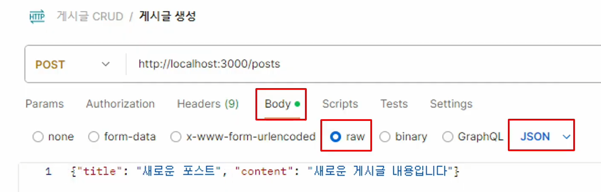
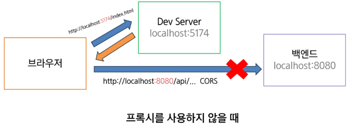
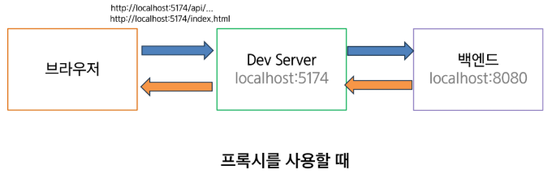
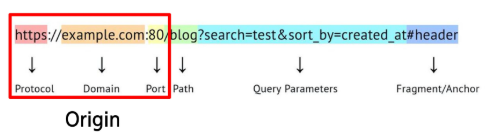
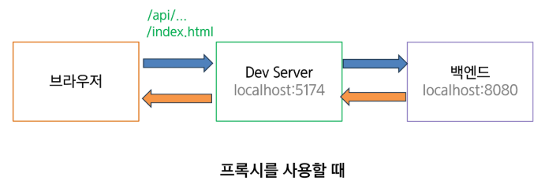

- [json-server](#json-server)
  - [JSON Server](#json-server-1)
  - [json-server 설정](#json-server-설정)
  - [복습](#복습)
  - [Postman](#postman)
- [json-server 실습](#json-server-실습)
- [Vue3 심화 학습](#vue3-심화-학습)
- [Vuetify 프레임워크](#vuetify-프레임워크)
- [실전 애플리케이션 만들기](#실전-애플리케이션-만들기)

# json-server

## JSON Server
### 도입 필요성
백엔드 API가 아직 개발이 되지 않았을 때, 백엔드 의존성 없이 프론트엔드 개발 진행 필요

### JSON Server란?
REST API를 생성하는 데 간단한 JSON 파일을 사용하여 가상의 백엔드 서버를 구현할 수 있다.
- 빠른 REST API 프로토타입 구축
- Zero 코딩으로 백엔드 구축 가능
- RESTful 규칙 자동 적용
- 프론트엔드 개발 시 Mock API 서버

## json-server 설정

### 설치
```bash
npm install json-server
```
설치 후 의존성(모듈) 일부 버전 문제로 인해 보안에러가 뜰 수 있음

### `db.json` 파일 생성
폴더 내에 `db.json`파일을 생성한다.
```json
{
  "posts" : [
    {
      "id": 1,
      "title": "json-server",
      "author": "typecode"
    }
  ],
  "comments" : [
    {
      "id": 1,
      "body": "some comment",
      "postId": 1
    }
  ]
}
```

### npx(Node Package eXecute)
패키지 관리가 아닌 실행에 초점이 맞춰져 있는 도구
```bash
npx json-server db.json
```
원하는 패키지를 실행할 수 있다.

### 실행

`localhost:3000`에 접속하여 브라우저를 통해 JSON Server가 정상적으로 실행중인지도 확인 가능

## 복습

> ### HTTP method
> - `GET`: Read (조회)
> - `POST`: Create (생성)
> - `PUT`: Update (해당 API 전체 수정)
> - `PATCH`: Update (해당 API 일부 수정)
>   - 예: 프로필 닉네임만 수정, 프로필 이미지만 수정
> - `DELETE`: Delete (삭제)
> - `OPTIONS`

> ### REST
> - REspresentational State Transfer
> - 웹 API를 구축하는 방법에 대한 규칙과 지침
> - `URL`을 통해 자원을 표현하고 `HTTP Method`를 통해 해당 자원에 대한 행위/상태를 주고받는 것

> ### REST API
> - 웹에서 자원을 주고받을 때 REST를 준수하는 것

> ### RESTful
> - 해당 REST 통신 방법을 잘 준수하여 설계한 API를 "RESTful하다"고 한다.

## Postman
> ### Postman
> API 테스트/개발 도구로 HTTP 요청을 쉽게 생성하고 전송 가능
> - 작업 환경을 컬렉션으로 저장/공유 (팀 협업에 용이)
> - 환경 변수 설정으로 개발/스테이징/프로덕션 환경 전환 가능
> - 자동화된 API 테스트 스크립트 작성 및 실행 지원
> - API 문서 자동 생성 및 실시간 동기화 기능 제공
> - 응답 데이터 자동 파싱 및 가시화 기능 보유

### json-server에서 Postman 사용 시 주의사항


- Body에서 form-data가 아니라 **raw -> JSON** 선택
- form-data는 Django에서 내부 Serializer 로직에 의해 처리되었기 때문에 사용할 수 있었던 것!!

### json-server 특성
- DB나 ORM 기능을 제공하지 않아서 별도의 스키마가 존재하지 않음. 
  - 스키마에 대한 유효성 검사를 진행하지 않기 때문에 스키마를 어겨도 문제가 발생하지 않음.
  - JSON 형태이고, REST API 통신 규칙을 준수하기만 하면 어떤 형태로든 삽입/삭제가 가능.
- `id`필드는 따로 넣어주지 않으면, 자동으로 현재 가지고 있는 데이터 중에서 `최댓값 + 1`이 자동으로 할당됨.

## 중첩 라우트
json-server는 리소스 간의 관계를 기반으로 자동으로 중첩된 라우트를 생성한다.

### 사용 방법
- 자원 간에 외래 키 관계가 있으면(`postId`) 자동으로 중첩 라우트가 생성.
- `post/1/comments`는 `/comments?postId=1`와 동일한 결과를 반환.
- POST, PUT, PATCH 요청 시 자동으로 `postId`가 설정.

```python
/posts/1/comments # 가능
/posts/1/comments/2/likes # 불가능
```
- 중첩 라우트는 한 단계까지만 지원한다.
  - 더 깊은 중첩이 필요한 경우에는 쿼리 파라미터를 사용해야 한다.

### Condition
- ` ` -> `==`
- `lt` -> `<`
- `lte` -> `<=`
- `gt` -> `>`
- `gte` -> `>=`
- `ne` -> `!=`

### Range
- `start`
- `end`
- `limit`
```
GET /posts?_start=10&_end=20
GET /posts?_start=10&_limit=10
```

### Paginate
`_page` 사용
```
GET /posts?_page=7
GET /posts?_page&limit=20
```
`limit`도 사용할 수 있음.

### Sort
`_sort`와 `order` 파라미터 사용

### Relationships
자식 리소스들을 같이 포함해서 조회하고 싶다면 `_embed` 사용 (예: 게시글로 댓글을 조회)
```
GET /posts?_embed=comments
GET /posts/1?_embed=comments
```
해당되는 부모 리소스들을 같이 포함해서 조회하고 싶다면 `_expand` (예: 댓글로 게시글을 조회)
```
GET /comments?_expand=post
GET /comments/1?_expand=post
```

## json-server-auth
json-server에 인증 기능을 추가해주는 미들웨어
- 간단한 인증 기능이 포함되어 있는 REST API 서버를 쉽게 구축 가능
- JWT(JSON Web Token) 기반의 인증 시스템 제공

### 설치
```
npm install json-server json-server-auth
```
만약 모듈을 못 찾는다는 에러가 나온다면 `package.json`에서 베타 버전의 모듈들을 다운그레이드.
```json
// package.json

{
  "dependencies": {
    "json-server": "^0.17.3",
    "json-server-auth": "^2.1.0"
  }
}
```
### 설정
`db.json`에 `"users"` 추가
```json
{
  "users": [],
  "posts": []
}
```

### 실행
```
npx json-server-auth db.json
```

### json-server-auth API
- 회원가입: `POST /register`
- 로그인: `POST /login`
- 사용자 정보 조회: `GET /users`

## JWT(Json Web Token)
### 배경
- 세션 기반 인증 방식의 한계 (서버단 세션 정보 저장 필요)
- 서버 확장이 어려움 (아웃 스케일링 구현의 어려움)
- 확장 가능한 인증 시스템 필요성

### 특징
- 확장 가능한 인증 시스템
- Stateless 서버 아키텍쳐 지향
- REST API에 적합한 인증 방식 요구
- **인증 시, DB와 상호작용이 없음**

### 구조
- `Header`: 토큰 타입과 해시 알고리즘 정보
- `Payload`: 사용자 정보와 권한 정보
- `Signature`: HMAC/RSA 기반 전자서명

### 비밀키 설정
기본으로 설정되어있는 비밀키는 보안상에 취약
```bash
# `JWT_SECRET_KEY` 환경변수 설정
$ export JWT_SECRET_KEY=ssafy123!

# 값 검증(출력)
$ echo $JWT_SECRET_KEY
ssafy123!

# 환경변수 설정과 동시에 서버 실행
$ export JWT_SECRET_KEY=ssafy123! && npx json-server-auth db.json
```

### json-server-auth 라우트 가드 파일 설정
라우트 가드의 경우에는 해당 리소스를 3가지 타입(소유주, 로그인, 비로그인)으로 인증을 부여하는 시스템

- **권한 값**
  - 6 = 쓰기 + 읽기 권한
  - 4 = 읽기 권한
  - 2 = 쓰기 권한
  - 0 = 권한 없음
- **세자리**
  - 소유자 / 일반유저 / 비로그인유저

```json
// routes.json

{
  "users": 600, // users는 모두 소유주 자신만 읽기/쓰기 가능하도록 설정
  "posts": 644 // posts는 소유주만 쓰기가 가능하고 나머지는 읽기만 가능
}
```

```bash
# 라우트 가드 파일 연결

$ npx json-server-auth db.json -r routes.json
```

### 게시글 CRUD - 인증

- **인증 정보 추가**
  - Postman에서 Auth 탭에 AccessToken을 넣게 되면 헤더 Authorization 값이 'Bearer' + AccessToken으로 설정됨

- `userId` 필드 추가
  - 제목, 내용과 함께 `userId`를 같이 넣어서 POST
  - 본인 userId만 가능(다른 경우에는 403에러 발생)

# json-server 실습


## Vue3 프로젝트 고도화
- vite proxy 설정
- 인증 스토어(authStore) 의존성 제거
- axios 인스턴스를 사용한 인터셉트를 통한 헤더 자동화
- REST API - CRUD 연산 작업: 모듈화

### vite proxy 설정
- 프록시 설정을 통해 CORS 문제를 해소할 수 있음
- API 요청 간소화



Origin이 동일하면 URL을 생략할 수 있음


`http://localhost:5174/api/..` -> `/api/..`

```js
export default {
  server: {
    proxy: {
      '/api' : {
        target: 'http://localhost:3000',
        changeOrigin: true,
        rewrite: (path) => path.replace(/^\/api/, '')
      }
    }
  }
}
```

`/api`로 오는 요청을 vite server의 중계를 거쳐 전달 가능(개발 도중에만)

### authStore 의존성 제거
```js
// 로컬스토리지에 token 저장

const login = (newToken) => {
  token.value = newToken;
  localStorage.setIte("token", newToken);
};

const logout = () => {
  token.value = null;
  localStorage.removeItem("token");
}
```
**첫번째 방법**
- main.js에 axios에 대한 공통 헤더 설정
```js
// 전역으로 기본 url 설정
axios.defaults.baseURL = "/api";

// 전역으로 토큰 설정
const token = localStorage.getItem("token");
if (token) {
  axios.defaults.headers.common["Authorization"] = `Bearer ${token}`;
}
```

**두 번째 방법**
- 토큰 취득과 동시에 이를 바로 공통 헤더에 탑재
```js
const login = async (credentials) => {
  try {
    const response = await axios.post('/api/login', credentials)
    const { token: newToken, user: userData } = response.data

    // 상태 업데이트
    token.value = newToken
    user.value = userData

    // localStorage에 토큰 저장
    localStorage.setItem('token', newToken)

    // axios 헤더 설정
    axios.defaults.headers.common["Authorization"] = `Bearer ${token}`;
  }
}
```

### axios 인스턴스를 사용한 인터셉트를 통한 헤더 자동화
- axios 인스턴스 생성
```js
// axios 인스턴스 생성
const instance = axios.create({
  baseURL: "/api"
  timeout: 5000,
})
```

- 해당 인스턴스를 사용하여 요청 시 토큰 헤더 설정 로직 실행
```js
// 요청 인터셉터 추가하여 헤더 설정
instance.interceptors.request.use(config => {
  // 요청을 받을 때 마다 해당 함수 실행
  const token = localStorage.getItem('token');
  if (token) {
    config.headers.Authorization = `Bearer ${token}`;
  } 
  return config;
})
```
- 외부 파일에서는 import 방법에 따라 활용 가능
```js
// axios 인스턴스 내보내기
export { instance as authApi };
```

```js
export { authApi } from './api';

// 사용
authApi.get('/users');
authApi.post('/login', { username, password });
```

### REST API - CRUD 연산 작업: 모듈화

- API 클라이언트 패키지화
- 재사용성, 유지보수성 향상

```js
function async login(credentails) {
  const response = await authApi.post("/accounts/login/", credentials);
  return response.data;
}

function async signup(userData) {
  const response = await authApi.post("/accounts/signup/", userData);
  return response.data;
}

function async logout() {
  const response = await authApi.post("/accounts/logout/");
  return response.data;
}

export {
  login as loginApi,
  signup as signupApi,
  logout as logoutApi
};
```

```js
import { loginApi } from "@/api/auth";

// 사용
const login = () => {
  const payload = data.value;
  loginApi(payload)
    .then(data => {
      router.push("/");
    }
  );
}
```

# Vue3 심화 학습

## Provide/Inject
- 컴포넌트 간의 데이터 전달의 새로운 방식
  - 상위 컴포넌트에서 하위 컴포넌트로 데이터 제공
  - 반응형을 유지한 채 데이터 제공 가능
  - Props는 부모-자식 간, Provide/Inject는 깊은 계층 간 데이터 전달에 유용

- 기존 Props 방식
  - props를 사용하여 깊이 중첩된 컴포넌트에 데이터 전달 시 Props Drilling 발생

### 흐름 순서
부모 컴포넌트로부터 provide를 통해 키-값 쌍으로 데이터 전달
```html
<script setup>
import { provide } from 'vue'

provide('message', '안녕')
</script>
```
자식 컴포넌트는 inject를 통해 필요한 데이터를 직접 주입
```html
<script setup>
import { inject } from 'vue'

const message = inject('message')
</script>
```

### 전달 가능한 데이터
반응형 변수 또한 provide로 전달 가능
```js
import { ref, provide } from 'vue'

const count = ref(0)
provide('key', count)
```
읽기 전용 속성으로도 전달 가능
```js
import { ref, provide, readonly } from 'vue'

const count = ref(0)
provide('read-only-count', readonly(count))
```
앱 수준으로도 전달 가능
```js
import { createApp } from 'vue'

const app = createApp({})

app.provide('message', '안녕!')
```

<br>

## v-slots
컴포넌트의 재사용성을 높이는 템플릿 분배 매커니즘

### 슬롯(slot)
props와 유사하게 템플릿 조각을 자식 컴포넌트에 전달하고, 자식 컴포넌트가 이를 조립하여 렌더링할 수 있도록 하는 기능
(주로 카드 컴포넌트)

### named slots
여러 슬롯을 구분하여 사용 `<template v-slot:name>`으로 지정

**`v-slot` 축약**
  - `v-slot:` => `#`
  - 예) `v-slot:header` => `#header`

### 조건부 슬롯
`$slots` 속성과 `v-if`를 결합하여 제공된 컴포넌트만 렌더링

```js
<template>
  <div class="card">
    <div v-if="$slots.header" class="card-header">
      <slot name="header" />
    </div>      

    <div v-if="$slots.default" class="card-content">
      <slot />
    </div>      

    <div v-if="$slots.footer" class="card-footer">
      <slot name="footer" />
    </div>      
  </div>
</template>
```

### 동적 슬롯 이름
`v-slot:[dynamicSlotName]`을 사용해 동적으로 슬롯 이름 할당 가능
```html
<base-layout>
  <template v-slot:[dynamicSlotName]>
    ...
  </template>

  <!--단축 문법 사용-->
  <template #[dynamicSlotName]>
    ...
  </template>
</base-layout>
```

<br>

## v-model
입력 요소와 데이터를 양방향으로 바인딩하여 값 변경 시 자동으로 업데이트 됨
- 커스텀 컴포넌트에서 사용
```html
<script setup>
  const props = defineProps(['modelValue'])
  const emit = defineEmits(['update:modelValue'])
</script> 

<template>
  <input
    :value="props.modelValue"
    @input="emit('update:modelValue',$event.target.value)"
  />
</template>
```
- `defineModel()` 매크로를 통해 부모 값과 로컬 값에 양방향 바인딩 되는 ref 반응형 변수를 얻을 수 있음
```html
<script setup>
  const model = defineModel()
</script> 

<template>
  <input v-model="model" />
</template>
```
- 다중 v-model 바인딩
  - 여러 속성을 동시에 바인딩, `v-model:name="variable"`형식으로 사용
```js
<UserName
  v-model:first-name="first"
  v-model:last-name="ast"
/>
```

## Suspense

- 비동기 컴포넌트
- 서버에서 컴포넌트를 로드해야할 때 사용하는 컴포넌트로, `setup` 훅 내 최상위에 `await` 표현식이 있는 컴포넌트

```html
<script setup>
const res = await fetch(...)
const posts = await res.json( )
</script>

<template>
  {{ post }}
</template>
```

- 비동기 컴포넌트 로딩
  - `Suspense`는 비동기 컴포넌트가 로드될 때까지 대체 콘텐츠를 표시하며, 로딩이 완료되면 실제 컴포넌트를 렌더링합니다.

- `Suspense`의 `fallback` 속성을 통해 설정할 수 있으며, 로딩 중 표시될 내용을 지정

`

# Vuetify 프레임워크

# 실전 애플리케이션 만들기